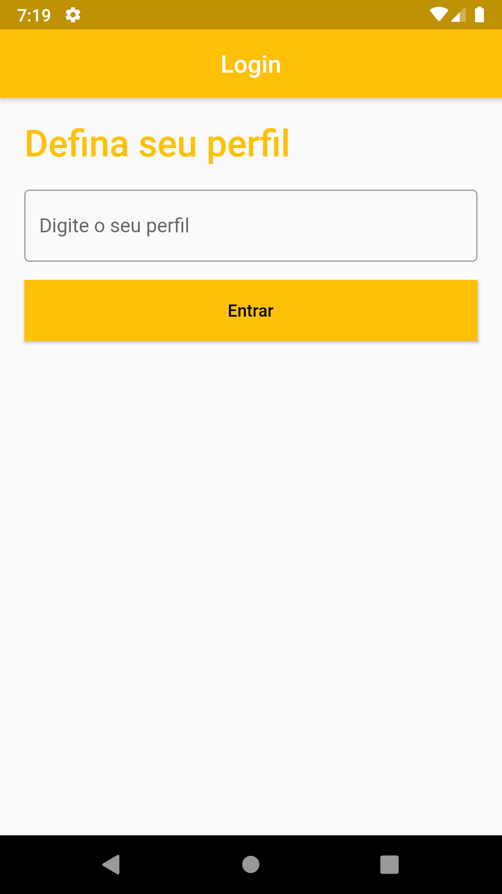
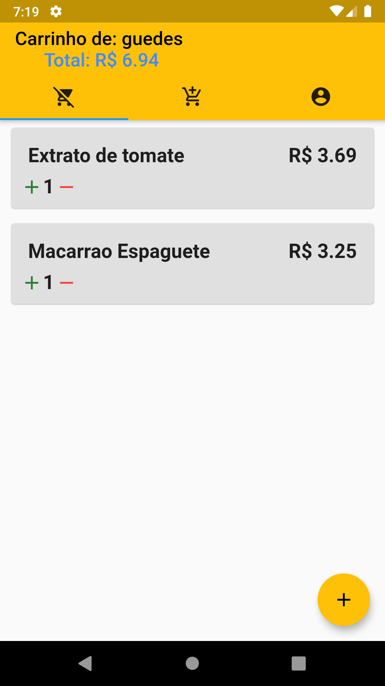
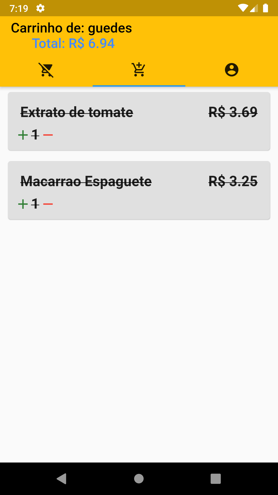
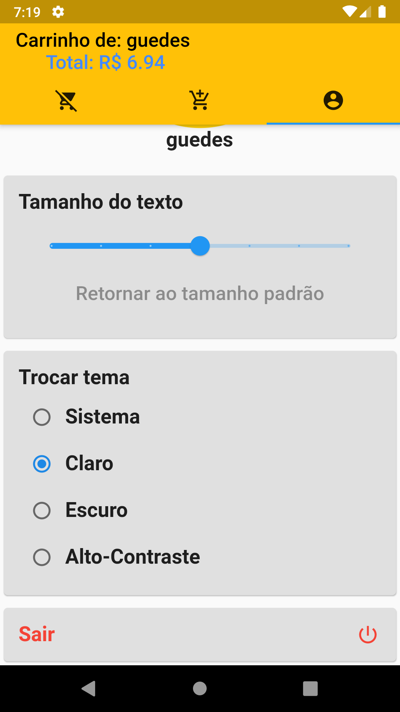

# flutter_grocery_list
Projeto prático de uma lista de compras para ajudar na ida ao supermercado.

Equipe:
1. Elias Cícero Moreira Guedes (Mentorado)
2. Antônio Honorato Moreira Guedes (Mentorado)
3. Israel Barbosa (Mentor)

## Features
1. Na tela de login, o usuário pode realizar seu cadastro (apenas inserindo seu nome), logando no sistema.

2. Após realizar o login no sistema, o usuário acessa sua Home page, onde poderá:
  1. Adicionar itens para comprar (na primeira aba). O usuário também pode editar, remover e marcar concluído seus itens.
  2. Ver os itens já comprados (na segunda aba).
  3. Ver informações sobre seu perfil e editar preferências (terceira aba).

3.Uma vez logado no sistema, o usuário permanece logado até realizar o logout (na terceira aba da tela principal). As preferências de tema e tamanho da fonte também permanecem.

## Screenshots

    
    
